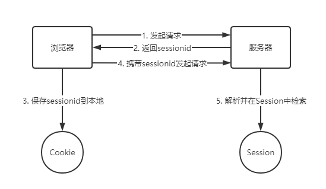

<!--
 * @LastEditors: panda_liu
 * @LastEditTime: 2020-10-06 19:42:25
 * @FilePath: \yunniubaod:\cs\计算机网络\demo\cookie.md
 * @Description: add some description
-->
# 为什么需要cookie

> 夏洛：大爷，楼上322住的是马冬梅家吧？

> 大爷：马冬什么？

> 夏洛：马冬梅。

> 大爷：什么冬梅啊？

> 夏洛：马冬梅啊。

> 大爷：马什么梅？

> 夏洛：行，大爷你先凉快着吧。


一次对话完成后下一次对话完全不知道上一次对话发生了什么。

Web应用程序是使用HTTP协议传输数据的。**HTTP协议是无状态的**。一旦数据交换完毕，客户端与服务器端的连接就会关闭，再次交换数据需要建立新的连接。这就意味着服务器无法从连接上跟踪会话。

想要确认身份该怎么办呢？给客户端们颁发一个通行证吧，每人一个，无论谁访问都必须携带自己通行证。这样服务器就能从通行证上确认客户身份了。这就是Cookie的工作原理。

# 什么是Cookie

Cookie意为“甜饼”，是由W3C组织提出，最早由Netscape社区发展的一种机制。目前Cookie已经成为标准，主流的浏览器都支持。

Cookie实际上是一小段的文本信息。客户端请求服务器，如果服务器需要记录该用户状态，就使用response向客户端浏览器颁发一个Cookie。客户端浏览器会把Cookie保存起来。当浏览器再请求该网站时，浏览器把请求的网址连同该Cookie一同提交给服务器。服务器检查该Cookie，以此来辨认用户状态。服务器还可以根据需要修改Cookie的内容。


# Cookie的特性

**不可跨域名性**

很多网站都会使用Cookie。例如，Google会向客户端颁发Cookie，Baidu也会向客户端颁发Cookie。那浏览器访问Google会不会也携带上Baidu颁发的Cookie呢？答案是不会的。Cookie具有不可跨域名性，不同域名的Cookie不会互相影响。Cookie在客户端是由浏览器来管理的。浏览器能够保证Google只会操作Google的Cookie而不会操作Baidu的Cookie，从而保证用户的隐私安全。

**Cookie中使用Unicode字符时需要对Unicode字符进行编码，否则会乱码**

**BASE64编码：保存二进制图片**

# Cookie常用属性

属性名|类型|描述
-|-|-
name | string | 该Cookie的名称。Cookie一旦创建，名称便不可更改
value | object | 该Cookie的值。如果值为Unicode字符，需要为字符编码。如果值为二进制数据，则需要使用BASE64编码
maxAge | int | 该Cookie失效的时间，单位秒。如果为正数，则该Cookie在maxAge秒之后失效。如果为负数，该Cookie为临时Cookie，关闭浏览器即失效，浏览器也不会以任何形式保存该Cookie。如果为0，表示删除该Cookie。默认为–1
domain | string | 指定了哪些主机可以接受 Cookie。如果不指定，默认为当前文档的主机（不包含子域名）。如果指定了 Domain，则一般包含子域名
path | string | 指定了主机下的哪些路径可以接受Cookie.以字符 (/) 作为路径分隔符，子路径也会被匹配。
secure | boolean | 该Cookie是否仅被使用安全协议（HTTPS、SSL等）传输。默认为false
HttpOnly | string | 为避免跨域脚本 (XSS) 攻击，通过 JavaScript 的 Document.cookie API 无法访问带有 HttpOnly 标记的 Cookie
 
# 如何使用Cookie

1. 我们可以通过给服务器端添加返回头来设置Cookie

``` js
response.headers('Set-Cookie', 'account=j%3A%7B%22account%22%3A%22panda%22%2C%22password%22%3A%224794bfb34dc43fea2259ded74e8a8ab9%22%7D; Max-Age=200; Path=/; Expires=Tue, 06 Oct 2020 05:31:22 GMT');
```

2. 在浏览器端中我们可以查看cookie

``` js
document.cookie // "account=j%3A%7B%22account%22%3A%22panda%22%2C%22password%22%3A%224794bfb34dc43fea2259ded74e8a8ab9%22%7D"
```

# Cookie应用场景

Cookie 主要用于以下三个方面：

- 会话状态管理（如用户登录状态、购物车、游戏分数或其它需要记录的信息）
- 个性化设置（如用户自定义设置、主题等）
- 浏览器行为跟踪（如跟踪分析用户行为等）

一个用户登录状态管理的案例：

服务器端（node.js）：

``` js
// 客户端发起登录请求时，先在数据库中验证身份
// 如果验证成功，向客户端返回一个cookie
router.post('/login', (req, res, next) => {
  const {
    account,
    pwd
  } = req.body;
  // 加密密码
  const password = hashPassword(account, pwd);
  // 验证登录信息
  if (checkAuth(account, password)) {
    // 返回cookie
    res.cookie('account', {
      account,
      password
    }, {
      maxAge: 200000,
    })
    res.send({
      code: 0,
      msg: '登录成功'
    })
  } else {
    res.send({
      code: 1,
      msg: '登录失败'
    })
  }
})
```

``` js
// 拦截所有请求，统一进行权限判断
router.all('*', (req, res, next) => {
  // 如果是登录请求，直接跳过
  if (req.path === '/login') {
    next();
  } else {
    // cookie为空，返回状态码401
    if (JSON.stringify(req.cookies) === "{}") res.status(401).send('no cookie');
    else {
      const item = req.cookies && req.cookies.account;
      // cookie符合规则，继续后续逻辑
      if (checkAuth(item.account, item.password)) next();
      // cookie不符合规则，返回状态码401
      else res.status(401).send('error cookie');
    }
  }
```

浏览器端（vue.js）：

``` js
const Fetch = async (url = '', type = 'GET', data = {}, params: Data = {}) => {
  // 设置请求头
  const headerObj: Data = {
    'Accept': 'application/json',
    'Content-Type': 'application/json'
  }

  // 配置请求参数
  let requestConfig: Data = {
    // 配置credentials，让每一次http请求都会携带cookie
    credentials: 'include',
    method: type,
    headers: headerObj,
    mode: 'cors',
    cache: 'force-cache'
  }

  const response = await fetch(url, requestConfig);
  // 如果返回的状态码为401 跳转至登录页
  if (response.status === 401) {
    alert('no authorization');
    jumpToLogin();
  }
  // 返回格式化的response对象
  return response.json();
}
```

# Cookie的弊端

1. 保存在客户端，容易被盗取或者利用

2. 单个Cookie只能存储4K的数据

3. Cookie中只能保存 ASCII 字符串

4. 不可跨域


# 什么是Session

Session是另一种记录客户状态的机制，不同的是Cookie保存在客户端浏览器中，**而Session保存在服务器上**。客户端浏览器访问服务器的时候，服务器把客户端信息以某种形式(内存中、redis、mongodb)记录在服务器上。这就是Session。客户端浏览器再次访问时只需要从该Session中查找该客户的状态就可以了。

# Session原理

session是基于cookie的。第1次请求时，服务器会把一个sessionid以cookie形式种植给浏览器。以后客户端在访问服务端时候，http请求会带着sessionid,服务器会先检查这个客户端的请求里是否已包含了一个session标识（sessionid）。如果已包含这个sessionId，则说明以前已经为此客户端创建过session，服务器就按照sessionId把这个session检索出来使用。



# Session应用场景

服务器端（node.js）：

``` js
// 配置session
app.use(session({
  secret: "Panda&L", // 设置签名密钥
  name: "sessionid",  // 设置cookie的name
  cookie: {
    maxAge: 80 * 10000 // 设置cookie过期时间
  },
  resave: true, // 强制保存，如果session没有被修改也要重新保存
  saveUninitialized: false // 无论有没有session cookie，每次请求都设置个session cookie 
}));
```

``` js
router.post('/login', (req, res, next) => {
  const {
    account,
    pwd
  } = req.body;
  const password = hashPassword(account, pwd);
  // 验证登录信息
  if (checkAuth(account, password)) {
    // 建立本次session
    req.session.sign = true;
    req.session.name = account;
    res.send({
      code: 0,
      msg: '登录成功'
    })
  } else {
    res.send({
      code: 1,
      msg: '登录失败'
    })
  }
})
```

``` js
if (req.path === '/login') {
  next();
} else {
  console.log(req.session);
  const {
    sign,
    name
  } = req.session;
  // 如果已经登录，继续后面的逻辑
  if (sign && checkAccount(name)) next();
  // 否则，返回401状态码
  else res.status(401).send('no session');
}
```

# Session的问题

1. Session是存储在服务器端，巨大并发的时候会使服务器资源急速飙升。

2. 如果后端机器是多台的话，因此多个机器间是无法共享Session的。

# 什么是JWT

Json web token (JWT), 是为了在网络应用环境间传递声明而执行的一种基于JSON的开放标准（(RFC 7519)。

Token机制相对于Cookie机制又有什么好处呢？

- **支持跨域访问**: Cookie是不允许垮域访问的，这一点对Token机制是不存在的，前提是传输的用户认证信息通过HTTP头传输。

- **无状态**：Token机制在服务端不需要存储session信息，因为Token自身包含了所有登录用户的信息，在客户端存储状态信息即可。

- **更适用CDN**：当后端系统有多台时，由于是客户端访问时直接带着数据，因此无需做共享数据的操作。

- **标准化**：因为Token是以Json的形式保存在客户端的，所以JWT是跨语言的。

# 基于token的鉴权机制

- 用户使用用户名密码来请求服务器
- 服务器进行验证用户的信息
- 服务器通过验证发送给用户一个token
- 客户端存储token，并在每次请求时附送上这个token值
- 服务端验证token值，并返回数据

那么token长什么样子嘞？

第一部分：header 头部
第二部分：payload 载荷
第三部分：signature 签名

**header**

- 声明类型

- 声明加密算法

``` js
{
  'typ': 'JWT',
  'alg': 'HS256'
}
```

然后将头部进行base64加密，构成第一部分

**payload**

- 标准/公共/私有的声明

``` js
{
  'sub': 'animals',
  'name': 'panda'
}
```

然后将载荷进行base64加密，构成第二部分

**signature**

- header（加密后）

- payload（加密后）

- secret密钥

这个部分需要base64加密后的header和payload使用.连接组成的字符串，然后通过header中声明的加密方式和secret组合加密，然后就构成了jwt的第三部分。

**注意**：secret是保存在服务器端的，jwt的签发生成也是在服务器端的，secret就是用来进行jwt的签发和jwt的验证，所以，它就是你服务端的私钥，在任何场景都不应该流露出去。一旦客户端得知这个secret, 那就意味着客户端是可以自我签发jwt了。

# token应用场景

服务器端（node.js）：

``` js
/*
* token.js
*/

const jwt = require('jsonwebtoken');
const secret = 'Panda&L'; // 密钥使用openssl创建更佳

// 用JWT类来管理token
class JWT {
  constructor() {}

  // 创建token
  createToken(payload, time) {
    const token = jwt.sign(payload, secret, {
      expiresIn: time
    })
    return token;
  }

  // 验证token
  verifyToken(token, callback) {
    jwt.verify(token, secret, callback);
  }
}

module.exports = new JWT();
```

``` js
router.post('/login', (req, res, next) => {
  const {
    account,
    pwd
  } = req.body;
  const password = hashPassword(account, pwd);
  if (checkAuth(account, password)) {
    // 封装载荷信息
    const payload = {
      account
    }
    // 创建token
    const token = jwt.createToken(payload, '1h');
    // 返回token给浏览器端
    res.header('Authorization', token);
    res.send({
      code: 0,
      msg: '登录成功'
    })
  } else {
    res.send({
      code: 1,
      msg: '登录失败'
    })
  }
})
```

``` js
router.all('*', (req, res, next) => {
  if (req.path === '/login') {
    next();
  } else {
    // 拿到请求头中的token
    const token = req.headers.authorization;
    // 拆解token
    jwt.verifyToken(token, (err, decode) => {
      // 登录过期 or 篡改token 导致拆解失败
      if (err) res.status(401).send('error token');
      // 拆解成功
      else next();
    });
  }
});
```

浏览器端（vue.js）：

``` js
const Fetch = async (url = '', type = 'GET', data = {}, params: Data = {}) => {

  const headerObj: Data = {
    'Accept': 'application/json',
    'Content-Type': 'application/json'
  }

  // 如果有token，则每次发起请求时带上token
  if (localStorage.getItem('token')) {
    headerObj['Authorization'] = localStorage.getItem('token');
  }

  let requestConfig: Data = {
    // 注释掉credentials， 因为我们不需要再发送cookie
    //credentials: 'include',
    method: type,
    headers: headerObj,
    mode: 'cors',
    cache: 'force-cache'
  }

  const response = await fetch(url, requestConfig);

  // 获取response中的token
  const token = response.headers.get('Authorization');
  // 如果存在token，存放在浏览器的本地存储中
  if (token) localStorage.setItem('token', token);

  if (response.status === 401) {
    alert('no authorization');
    jumpToLogin();
  }
  return response.json();
}
```


相信大家看到这应该对Cookie、Session、Token有一定的了解了。